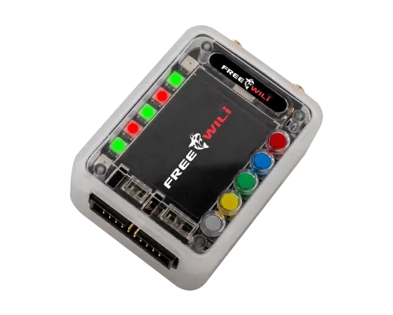

# wiliOGbsp — FreeWili 1 OG Board Support Package



Board-support monorepo for the **FreeWili 1 OG**, which carries two RP2040s: a
display CPU (ST7789 LCD, five color buttons, 7 WS2812 LEDs, IR, PDM mic, I2S
speaker, I2C sensors) and a main CPU (two CC1101 sub-GHz radios, an iCE40
FPGA, user breakout I/O). One CMake configure builds both.

Agents and contributors: read [AGENTS.md](./AGENTS.md) first.

**FreeWili 1 OG** is the new name for the FreeWili 1 firmware. It supports
easy bootloading, open-source hardware, and generating a single UF2 file that
flashes both CPUs.

## Loading what you build — the FreeWili OG App Explorer

**[FreeWili OG App Explorer](https://github.com/freewili/fwOGAppExplorer)**
loads the apps this BSP builds. Point it at a board and it flashes an
FwOGapp — the single UF2 that carries both CPUs' firmware — without you
having to know which CPU is which or how to reach BOOTSEL.

That works because the two ends agree by construction. Every app built here
carries a `fwog_uf2_info_t` record naming its CPU, app name, version and
description, and a USB identity the host can match; the App Explorer reads
exactly those. An FwOGapp also powers the device on and off consistently and
supports automatic bootloading. This BSP is what builds an app the right way,
so the App Explorer can load it — the rules are enumerated as "The FwOGapp
contract" in [AGENTS.md](./AGENTS.md).

## Quick start

Prerequisites: Pico SDK 2.3.0 and the arm-none-eabi toolchain under
`~/.pico-sdk`, plus Python 3. Host tests additionally want MSYS2 MinGW GCC on
Windows.

```bash
fw bootloader              # once per board: serial bootloader -> display CPU
fw build template_main     # build a main-CPU app (carries the display image)
fw flash template_main     # BOOTSEL that CPU, then it copies the .uf2
fw console                 # attach to the display bootloader's USB console
fw test                    # host unit tests, no hardware
```

`fw bootloader` is the once-per-board step. After it, display firmware is
embedded in main's UF2 and arrives over the inter-CPU link automatically —
one file flashes both CPUs.

Two rules worth knowing before you plug anything in:

- Put only **one** CPU in BOOTSEL at a time. Both present the same USB serial,
  so with two mounted neither the tools nor you can tell which is which.
- Never `fw flash` a display *application*. It will not boot and it takes the
  display CPU off USB — the one CPU with no BOOTSEL button. Display apps ride
  along inside the main CPU's UF2. See [AGENTS.md](./AGENTS.md) for the full
  reason and the recovery path.

## What's in `apps/`

**One folder per app, with the CPU halves inside it.** A display app and its
main companion are one deliverable — the main UF2 carries the display image
inside it — so they live together and share a `CMakeLists.txt`:

```
apps/ogvegas/
    CMakeLists.txt      declares both ogvegas_display and ogvegas_main
    display/main.c
    main/main.c
```

Targets keep their `_display`/`_main` suffix; only the folder drops it. A
folder with no `main/` has no companion.

| App         | What it is                                                                       |
| ----------- | -------------------------------------------------------------------------------- |
| `template`  | The skeleton `fw new-app` copies. Start here.                                    |
| `ogvegas`   | Showcase: LCD image, audio replay and an animated LED comet, all at once.        |
| `lvgl`      | LVGL example — a list you drive with the front-panel buttons. Opt-in, see below. |
| `bench`     | Console for poking every driver from the host, via `tools/bench.py`.             |
| `smoke`     | Bare-board bring-up: clocks, USB, the inter-CPU link.                            |
| `lcd`       | ST7789 panel bring-up on its own.                                                |
| `bl`        | The display serial bootloader. Flashed once per board.                           |
| `cpuprobe`  | Answers "which CPU is this?" on a board where you cannot tell.                   |

### LVGL

The BSP ships an **LVGL 9 port** — the ST7789 as an LVGL display, and the five
buttons as an LVGL keypad — in `bsp/display_cpu/lvgl/`.

**LVGL itself is not vendored here.** Your project supplies it and the BSP
builds `fwog_display_lvgl` against it, the same arrangement it has with the
Pico SDK. To try the example without wiring that up yourself, let this repo
fetch LVGL for you:

```bash
cmake --preset target -DFWOG_LVGL_FETCH=ON
cmake --build build --target lvgl_main
fw flash lvgl_main
```

Budget for it: roughly **390 KB of flash and 143 KB of RAM** of the RP2040's
264 KB, against ~32 KB for a bare display app. That is why it is opt-in.

## Status

The foundation, the display serial bootloader and its update path are
complete, and most peripheral drivers are implemented and have been exercised
on hardware.

| Area                                                  | State                                                               |
| ----------------------------------------------------- | ------------------------------------------------------------------- |
| Clocks, link, diagnostics, bootloader, display update | Working, verified on hardware                                       |
| LCD (ST7789), buttons, WS2812 LEDs, ship mode         | Working, verified on hardware                                       |
| CC1101 radios ×2, IR TX/RX, PDM mic, I2S speaker      | Working, verified on hardware                                       |
| LIS3DH accelerometer, MCP7940 RTC, PCAL6416 expander  | Working, verified on hardware                                       |
| iCE40 FPGA loader                                     | Bitstream loads and `CDONE` asserts; no gateware function exercised |
| LVGL 9 port (display + keypad)                        | Builds and links against LVGL v9.2.2; **not yet run on a board**     |
| Breakout I/O direction control                        | Code complete and host-tested, but **never run on a board**          |

Known gaps: crash-safety under power loss mid-update, ship-mode current draw
(nothing on the board can measure it), the FPGA's gateware behaviour, the
breakout I/O direction sequencer, and the LVGL port.

## License

**Dual licensed** — see [LICENSE](./LICENSE) and [NOTICE](./NOTICE).

| What you're building                      | License                                                                                    |
| ----------------------------------------- | ------------------------------------------------------------------------------------------ |
| Firmware targeting **FreeWili hardware**  | FreeWili Hardware License — MIT text plus a field-of-use condition. Free, no registration. |
| Firmware targeting **any other hardware** | Commercial license required; contact [Intrepid Control Systems](https://intrepidcs.com/).  |

The free option is **not** the MIT License and **not** open source: it is MIT's
text with a hardware field-of-use condition added. Please don't describe it as
either.

Bundled third-party components (FatFs, the wilibsp-derived CIC filter, the Pico
SDK board header, and the LVGL-derived `lv_conf.h`) keep their own more
permissive licenses and are **not** subject to the hardware condition — see
[THIRD-PARTY-NOTICES.md](./THIRD-PARTY-NOTICES.md). LVGL itself is not
distributed here.
